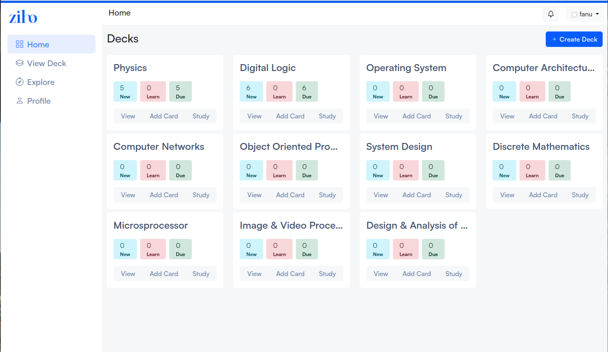
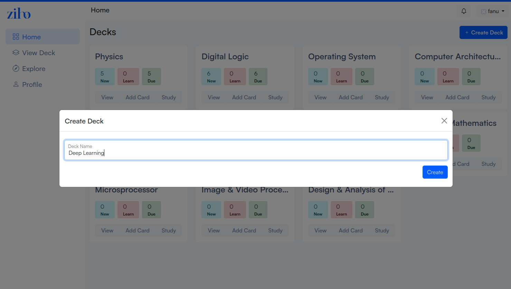
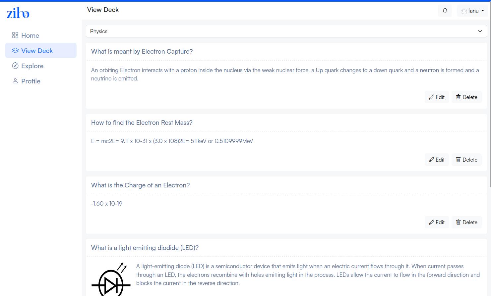
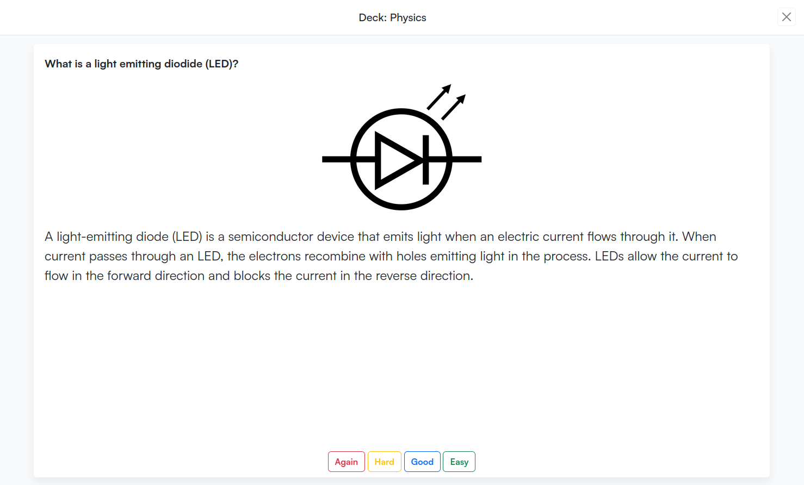
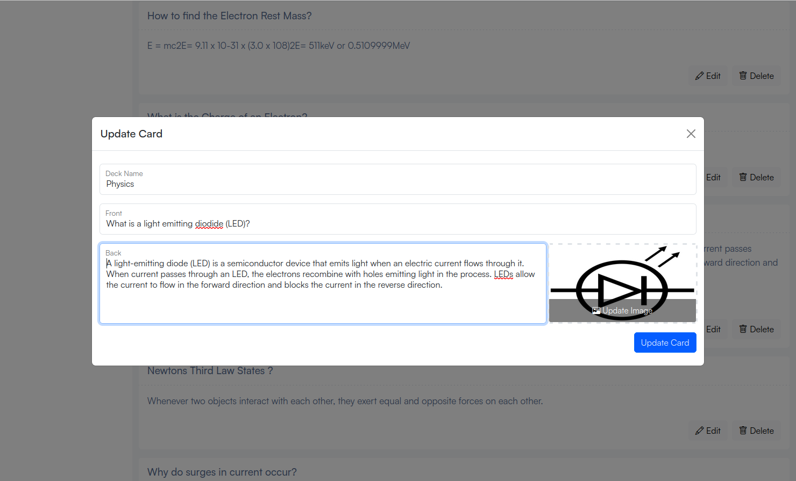
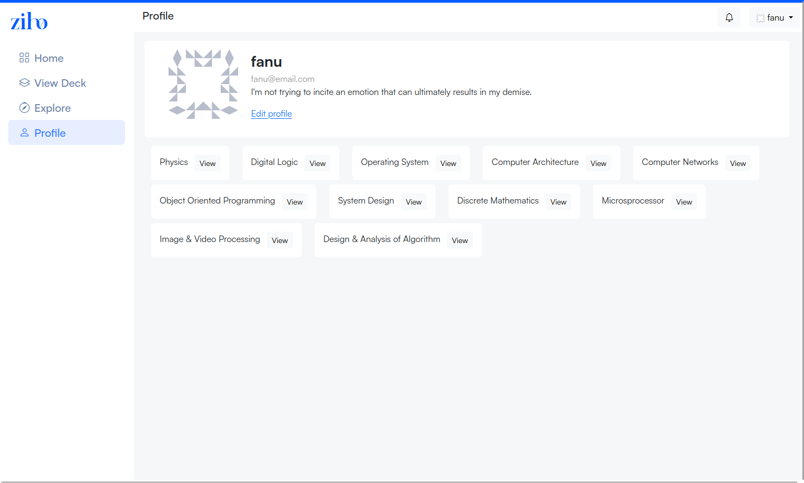
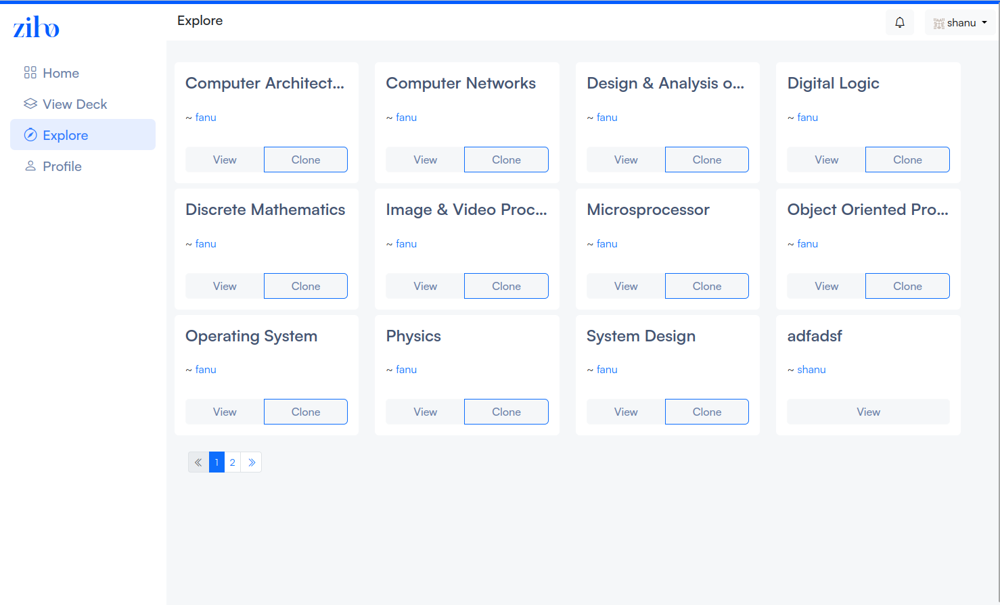

# Ziho

Ziho is an online programme for flashcards. It helps the user memorise information by utilising cognitive science strategies like spaced repetition and active recall testing.


## Built With

- [Flask](https://flask.palletsprojects.com/en/3.0.x/)
- [SQLite](https://sqlite.org/)
- [Docker](https://www.docker.com/)

## Screenshots

<p float="left">







</p>


## Getting Started 

### Install & Run

- Setup
```
./tools/setup
```

- Run

```
./tools/run-ziho
```

- For dev enviroment 

```
./tools/run-ziho-dev
```

- For docker container

```
docker compose up
```

## Contribution

**Be consistent with existing code**

### Use the linters

```
./tools/lint_and_format
```

### Use the tests

```
pytest tests/
```
